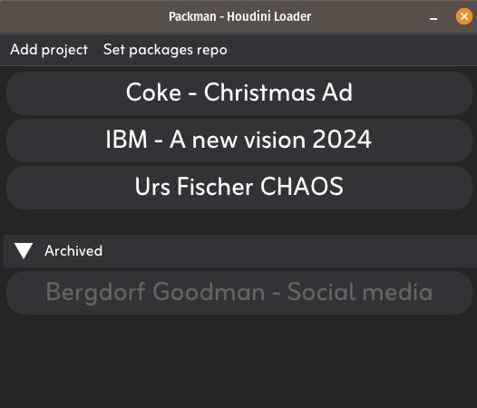
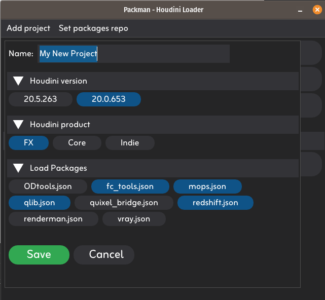
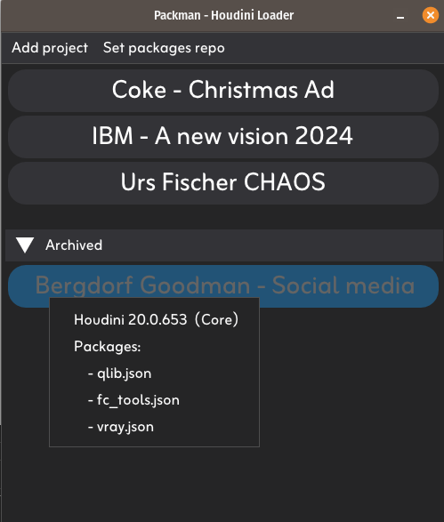
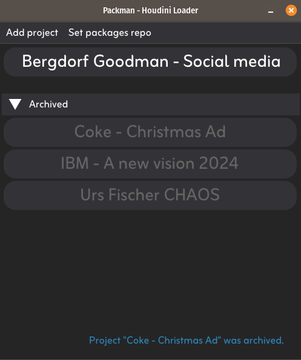
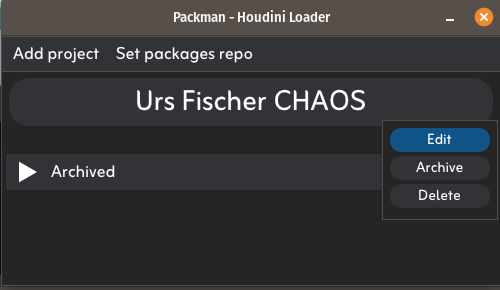

# Packman
A simple, project based, houdini loader and package manager for Linux.   
(Download latest version from the [Releases](https://github.com/fabriciochamon/Packman/releases) page)

## How different from a regular Houdini launcher ?

In Packman you can customize Houdini versions, products (FX/Core/Indie), and json packages per project, in a nice and clean user interface.

## How it works:
1. Collect all your .json packages into a repository folder.
2. Make sure to remove them from your user folder (they will now be loaded on demand, by Packman).
3. Add a new Packman project, choose versions and packages you wish to load.
4. Open your Houdini sessions from there.
5. Done! Now you can quickly setup per project environments with just a fews clicks.

## Screenshots:

*Simple/minimal UI*  

*Project configuration (auto scan for available installs and packages)*  

*Quick inspect configs on mouse hover*  

*Archive old projects, but keep track of the settings in case you need to re-open files*  

*Right click projects to modify/archive/delete them*    

## Step-by-step tutorial:

1. **Collect** all your .json packages into a single folder (without subfolders!) 

2. Make sure to also **remove** these files from other folders scanned by Houdini, like $HOUDINI_USER_PREF_DIR/packages for example. Packman can't override Houdini's default scan directories!

3. After launching Packman for the first time, make sure to set the packages repository: 
Menu **Set packages repo** > choose your repo folder in the file dialog.

2. Create a new project:  
Menu **Add project**  > Fill in your project details

3. Optionally, right click any project to **edit/archive/delete**. (Archived projects can also be restored this way).

4. Launch a new Houdini session with a managed environment by clicking the **big buttons**!

*tip: resize/reposition the Packman window as you wish, it will remember the next time!

## Technical info:

- Houdini installs are assumed to live under the default /opt folder.

- All project configs are stored as .json files (with their corresponding folders) inside ~/.packman/configs or ~/.packman/archived. You can delete multiple configs at once by manually removing those files.

- Config names will only allow for these characters: a-z | A-Z | 0-9 | dash, underscore, whitespace

